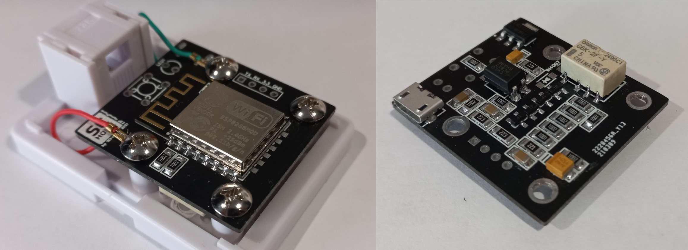
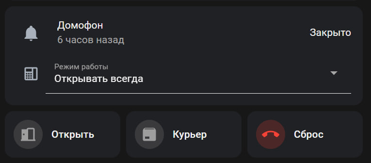

# SmartIntercom

Умный домофон на ESP

(Устройство удаленного управления абонентской линией координатных домофонных систем)

Поддерживается передача аудио потока на блок вызова. Перед использованием этой функции необходимо передать плате аудио файлы для воспроизведения:
- Для плат на базе ESP8266: записать аудио файлы *.wav из папки data в LittleFS.
- Для плат на базе ESP32: Для воспроизведения по HTTP,- подготовить вспомогательные компоненты HomeAssistant [input_text.yaml](ESPHome/input_text.yaml) в которых прописываются ссылки на аудио файлы. Для воспроизведения с SD карты, - записать аудио файлы из папки data в корень SD карты. Для воспроизведения из LittleFS - записать файлы *.mp3 из папки data в LittleFS.

Для воспроизведения аудио файлов используется библиотека https://github.com/earlephilhower/ESP8266Audio.

При использовании ESPHome воспроизведение mp3 файлов на платах ESP8266 невозможно из-за нехватки оперативной памяти МК, поэтому используем WAV (PCM 22кГц 16 Бит (signed) Моно).

## Хотите купить:
Купить готовое устройство можно в https://shop.scrators.ru

У Вас уже есть готовое и прошитое устройство, которое вы приобрели, и вы не знаете как начать с ним работать? - Почитайте [userguide.pdf](userguide.pdf)

## Нужно прошить/перепрошить устройство:
### При использовании ESPHome (на примере HomeAssistant и устройств на базе ESP8266)
1. Установить из магазина дополнений "ESPHome" и "FileEditor"
2. Запустить дополнение FileEditor и перейти к рабочий каталог /сonfig/esphome/
3. Используя меню "File Upload" загрузить файл [smartintercom-esp8266.yaml](ESPHome/smartintercom-esp8266.yaml)
4. Используя меню "Create Folder" создать папку lib и перейти в неё
5. Используя меню "File Upload" загрузить файлы библиотек [ESPAudio.h](ESPHome/lib/ESPAudio.h) и [ESPUtils.h](ESPHome/lib/ESPUtils.h)
6. Запустить дополнение ESPHome, - там появится проект "smartintercom" в статусе OFFLINE
7. Для того чтобы статус устройства стал ONLINE, проект должен быть скомпилирован.
8. Нажать на проекте "...", выбрать меню "INSTALL", выбрать способ прошивки (просто для компиляции можно выбрать "Manual Download - Modern Format"). Во время компиляции все необходимые библиотеки ESPHome загрузит сам
9. После успешной прошивки, и выхода устройства в Онлайн, нужно загрузить аудио файлы, для этого подключаемся к плате по FTP (пассивный режим, анонимное соединение без пароля), и копируем файлы *.wav из папки [data](data/) в корень FTP
10. По желанию добавить карточку устройства на панель lovelace из файла [card.yaml](ESPHome/card.yaml) проекта.

### При использовании ESPHome (на примере HomeAssistant и устройств на базе ESP32)
1. Установить из магазина дополнений "ESPHome" и "FileEditor"
2. Запустить дополнение FileEditor и перейти к рабочий каталог /сonfig/esphome/
3. Используя меню "File Upload" загрузить файл [smartintercom-esp32.yaml](ESPHome/smartintercom-esp32.yaml)
4. Используя меню "File Upload" загрузить файл [partitions_esp32.csv](ESPHome/partitions_esp32.csv)
4. Используя меню "Create Folder" создать папку lib и перейти в неё
5. Используя меню "File Upload" загрузить файлы библиотек [ESPAudio.h](ESPHome/lib/ESPAudio.h) и [ESPUtils.h](ESPHome/lib/ESPUtils.h)
6. Запустить дополнение ESPHome, - там появится проект "smartintercom" в статусе OFFLINE
7. Для того чтобы статус устройства стал ONLINE, проект должен быть скомпилирован.
8. Нажать на проекте "...", выбрать меню "INSTALL", выбрать способ прошивки (просто для компиляции можно выбрать "Manual Download - Modern Format"). Во время компиляции все необходимые библиотеки ESPHome загрузит сам
9. После успешной прошивки, и выхода устройства в Онлайн, нужно загрузить аудио файлы, для этого подключаемся к плате по FTP (пассивный режим, анонимное соединение без пароля), и копируем файлы *.mp3 из папки [data](data/) в корень FTP
10. По желанию добавить карточку устройства на панель lovelace из файла [card.yaml](ESPHome/card.yaml) проекта. 

### При использовании ESP Download Tools (ESP8266) - Прошивка для воспроизведения Аудио файлов из LittleFS
1. Основной файл прошивки [ESP8266_smartintercom.bin](bin/ESP8266_smartintercom.bin) - Прошивать в адрес 0x0
2. Аудиофайлы в виде образа LittleFS [ESP8266_mklittlefs_0x200000.bin](bin/ESP8266_mklittlefs_0x200000.bin) - Прошивать в адрес 0x200000
### При использовании ESP Download Tools (ESP32) - Прошивка для воспроизведения Аудио файлов из LittleFS
1. Основной файл прошивки [ESP32_smartintercom.bin](bin/ESP32_smartintercom.bin) - Прошивать в адрес 0x0
2. Аудиофайлы в виде образа LittleFS [ESP32_mklittlefs_0x2B0000.bin](bin/ESP32_mklittlefs_0x2B0000.bin) - Прошивать в адрес 0x2B0000
## Дополнительно:
Добавление управления через Телеграм:
https://github.com/SCratORS/SmartIntercom/issues/3
https://github.com/SCratORS/SmartIntercom/issues/6

Управление через Алису:
https://github.com/SCratORS/SmartIntercom/issues/7
https://github.com/SCratORS/SmartIntercom/issues/9

Автоматическое отключение однократного открытия домофона:
https://github.com/SCratORS/SmartIntercom/issues/8

Схема устройсва и описание:
https://oshwlab.com/scrators/intercom-v4b

Телеграм канал для обсуждения:
https://t.me/smartintercom
